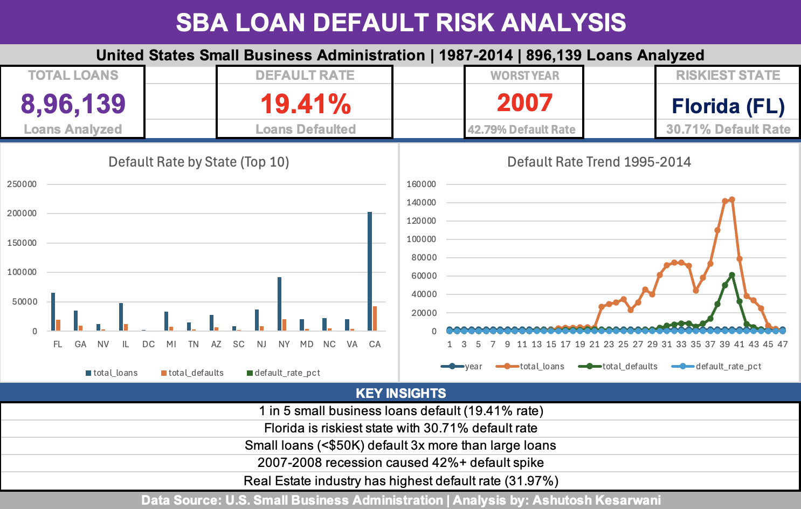
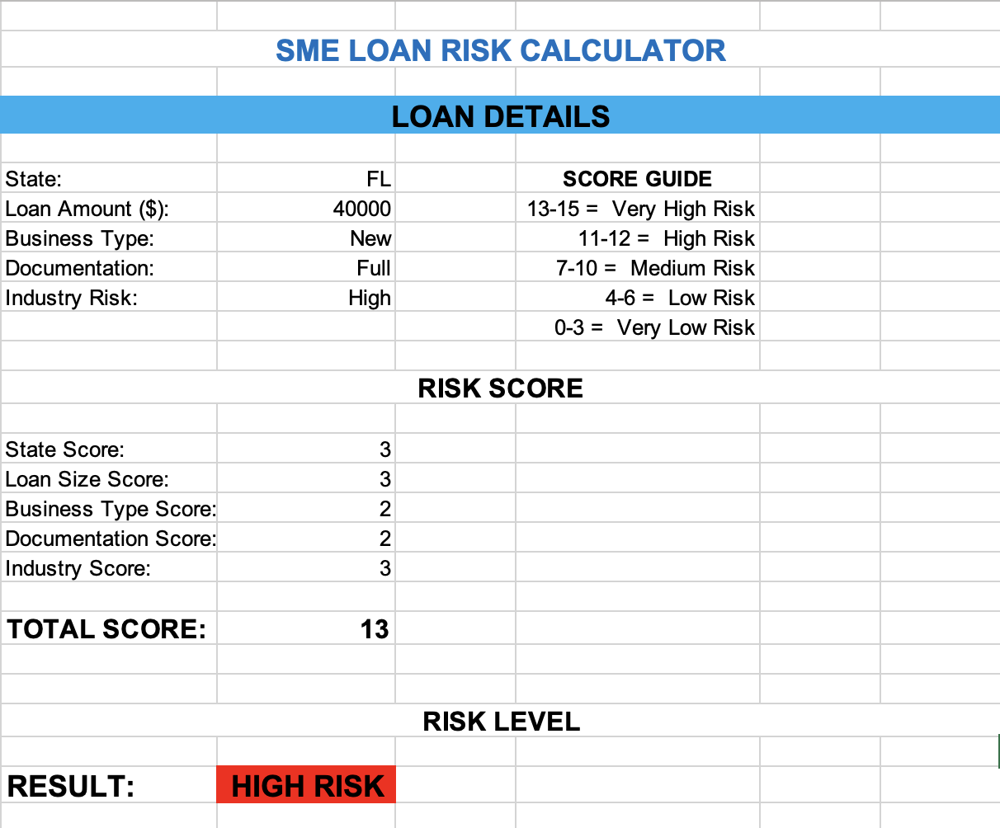

# 📊 SME Loan Default Risk Analysis
### Evidence from U.S. Small Business Administration Loan Data (1987–2014)

---

## 📌 Project Overview

This is an independent data analytics project analysing **896,139 U.S. Small Business Administration (SBA) loan records** spanning 1987 to 2014. The goal was to identify the key risk factors that drive SME loan defaults and build an interactive Risk Scoring Model for lenders.

No course. No assignment. Just curiosity and data.

---

## 🔍 Key Findings

| Finding | Result |
|---|---|
| Overall Default Rate | **19.41%** — 1 in 5 loans fail |
| Riskiest State | **Florida (FL) — 30.71%** |
| Riskiest Industry | **Real Estate (53) — 31.97%** |
| Safest Loan Size | **Very Large (500K+) — 8.57%** |
| Riskiest Loan Size | **Small (<50K) — 23.98%** |
| Worst Year | **2007 — 42.79%** (Great Recession) |
| New vs Existing Business | **Only 1.4% difference** |
| Low Doc vs Full Doc | **9.61% vs 20.51%** (counterintuitive!) |

---

## 🛠️ Tools & Technologies

| Tool | Purpose |
|---|---|
| **Python (Pandas)** | Data exploration & cleaning |
| **Jupyter Notebook** | Analysis environment |
| **MySQL** | Database management & SQL queries |
| **Microsoft Excel** | Dashboard & Risk Scoring Model |

---

## 📁 Project Structure
---

## 📊 Dashboard Preview

### KPI Dashboard

### Risk Scorer

---

## 🔎 SQL Analysis — 7 Queries

| # | Query | Key Finding |
|---|---|---|
| 1 | Overall Default Rate | 19.41% baseline |
| 2 | State-wise Default | Florida highest at 30.71% |
| 3 | Industry-wise Default | Real Estate highest at 31.97% |
| 4 | Loan Size vs Default | Small loans 3x riskier |
| 5 | New vs Existing Business | Only 1.4% difference |
| 6 | Documentation Type | Low doc loans safer |
| 7 | Yearly Trend | 2007 peak at 42.79% |

---

## 🧹 Data Cleaning Summary

| Step | Action | Rows Affected |
|---|---|---|
| Removed blank MIS_Status | Target variable missing | 1,997 rows |
| Removed NewExist = 0 | Undefined category | 1,028 rows |
| Cleaned money columns | Removed $ and , symbols | All rows |
| Fixed RevLineCr | Kept Y/N only | ~15,000 rows |
| Fixed LowDoc | Kept Y/N only | ~1,900 rows |
| **Final clean dataset** | **Ready for analysis** | **896,139 rows** |

---

## 🎯 Risk Scoring Model

Built an interactive SME Loan Risk Calculator in Excel that scores borrowers across 5 dimensions:

| Dimension | High Risk | Low Risk |
|---|---|---|
| State | FL, GA, NV | CA, TX, WA |
| Loan Size | Under $50K | Above $500K |
| Business Type | New | Existing |
| Documentation | Full Doc | Low Doc |
| Industry | Real Estate, Finance | Professional Services |

**Risk Tiers:**
- 🔴 Score 11-15 → HIGH RISK
- 🟡 Score 6-10 → MEDIUM RISK
- 🟢 Score 0-5 → LOW RISK

---

## 💡 Most Interesting Insights

**1. Small loans are riskier than large loans**
Loans under $50K default at 23.98% vs 8.57% for loans above $500K. Banks should apply stricter criteria to micro-loans, not large ones.

**2. New vs Existing business barely matters**
Only 1.4% difference in default rate. Business age alone should not be a primary lending criterion.

**3. Low documentation = lower default**
Low doc loans default at 9.61% vs 20.51% for fully documented loans. Documentation quantity ≠ borrower quality.

**4. 2007-2008 recession clearly visible in data**
Default rate jumped from 18.41% in 2004 to 42.79% in 2007 — a 134% increase in just 3 years.

---

## 📄 Research Paper

A full 12-page independent research paper was written documenting methodology, findings, and recommendations.

---

## 📬 Connect

**Ashutosh Kesarwani**
MSc Business Analytics — Aston University, Birmingham
hritik926@gmail.com

---

*Dataset Source: U.S. Small Business Administration via Kaggle*
*Independent Research Project — June 2026*
